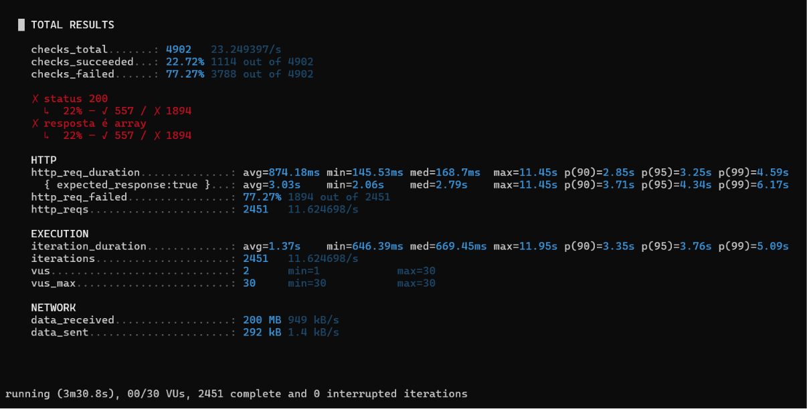
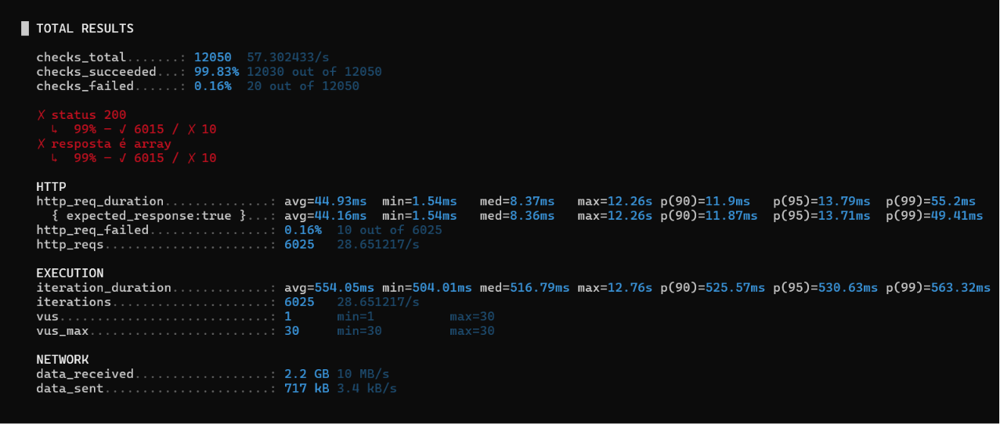
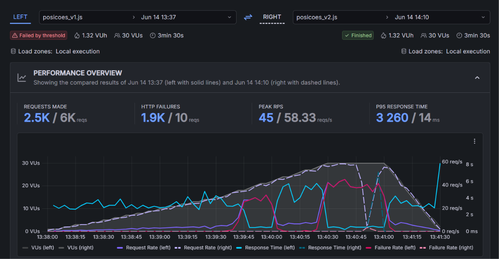
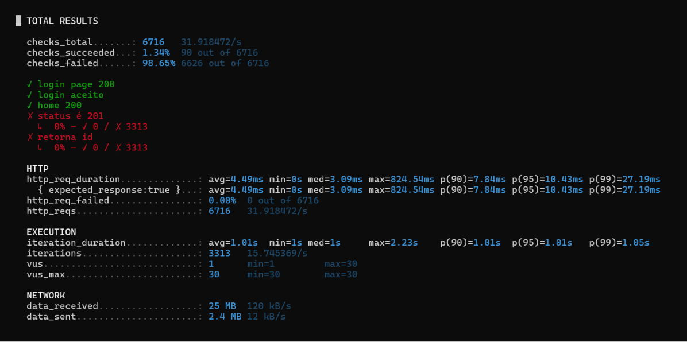
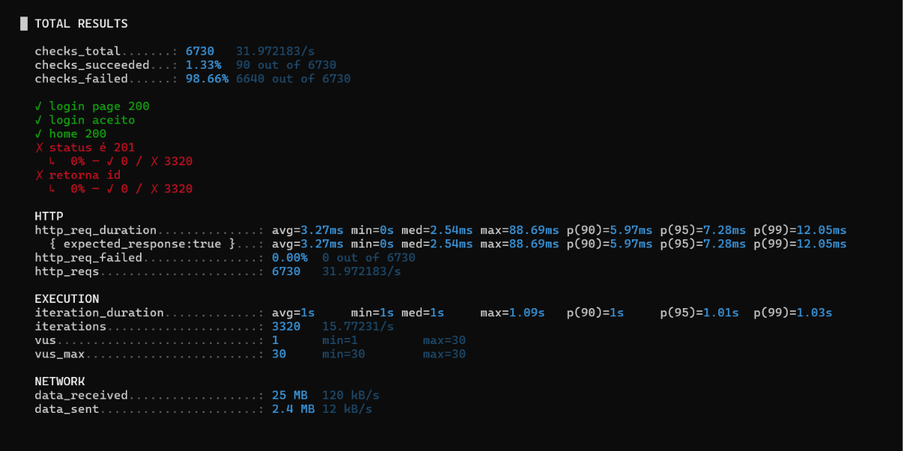
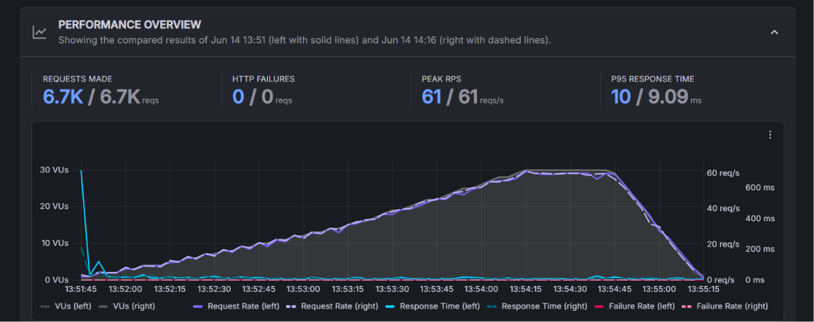

# MEDIÇÕES DO SLA

Relatório de testes de carga realizados com **k6**, comparando duas versões do sistema Unibus:

* **v1:** versão anterior às melhorias;
* **v2:** versão após implementação das otimizações.

## Metodologia Experimental

Os testes da segunda etapa foram executados utilizando exatamente o mesmo cenário de carga da primeira etapa, permitindo a comparação direta entre as duas versões do sistema.

Configuração utilizada em ambas as medições:

* Ferramenta: k6;
* Duração total: aproximadamente 3 minutos e 30 segundos;
* Perfil de carga: rampa de 5 → 15 → 30 usuários virtuais (VUs);
* Concorrência máxima: 30 VUs;
* Ambiente: aplicação Spring Boot executando localmente (`localhost:8080`);
* Banco de dados: MySQL local;
* Objetivo: avaliar o impacto das otimizações implementadas.

---

# Serviço 1 — API de posições dos ônibus

| Campo               | Valor                      |
| ------------------- | -------------------------- |
| Endpoint            | `GET /api/onibus/posicoes` |
| Tipo                | Consulta                   |
| Dependência externa | API pública do SPPO        |

## Hipótese levantada na 1ª etapa

A hipótese inicial era que a principal causa da degradação do desempenho estava relacionada à dependência direta da API externa do SPPO. Cada requisição realizada pelos usuários disparava uma nova consulta ao serviço externo, provocando saturação sob carga concorrente.

## Melhorias implementadas

* Implementação de cache com Caffeine;
* Expiração automática do cache;
* Pré-alocação de estruturas em memória;
* Enriquecimento paralelo dos dados;
* Redução do número de chamadas redundantes à API externa.

## Resultados da versão 1 (antes das melhorias)

### Métricas observadas

| Métrica            | Resultado   |
| ------------------ | ----------- |
| Latência média     | 874,18 ms   |
| Mediana            | 168,70 ms   |
| p95                | 3,25 s      |
| p99                | 4,59 s      |
| Vazão              | 11,62 req/s |
| Requisições totais | 2.451       |
| Taxa de falha HTTP | 77,27%      |

## Resultados da versão 2 (após as melhorias)

### Métricas observadas

| Métrica            | Resultado   |
| ------------------ | ----------- |
| Latência média     | 44,93 ms    |
| Mediana            | 8,37 ms     |
| p95                | 13,79 ms    |
| p99                | 55,20 ms    |
| Vazão              | 28,65 req/s |
| Requisições totais | 6.025       |
| Taxa de falha HTTP | 0,16%       |

## Comparação entre v1 e v2

| Métrica            | v1          | v2          | Variação   |
| ------------------ | ----------- | ----------- | ---------- |
| Latência média     | 874,18 ms   | 44,93 ms    | −94,9%     |
| p95                | 3,25 s      | 13,79 ms    | −99,6%     |
| p99                | 4,59 s      | 55,20 ms    | −98,8%     |
| Vazão              | 11,62 req/s | 28,65 req/s | +146,6%    |
| Requisições totais | 2.451       | 6.025       | +145,8%    |
| Taxa de falha      | 77,27%      | 0,16%       | −77,1 p.p. |

## Comparação gráfica

A linha referente à v1 representa o comportamento antes das otimizações, enquanto a linha da v2 representa o comportamento após a implementação do cache. Como os testes utilizaram exatamente o mesmo perfil de carga, as curvas podem ser comparadas diretamente.

## Conclusão do Serviço 1

Os resultados confirmam a hipótese levantada na primeira etapa. A implementação do cache eliminou praticamente todas as falhas associadas à dependência da API externa e reduziu drasticamente os tempos de resposta.

A melhoria foi efetiva, aumentando significativamente a capacidade do sistema de atender usuários simultâneos sem degradação perceptível.

---

# Serviço 2 — Inserção de ocorrências

| Campo                 | Valor                   |
| --------------------- | ----------------------- |
| Endpoint              | `POST /api/ocorrencias` |
| Tipo                  | Inserção                |
| Dependência principal | MySQL                   |

## Hipótese levantada na 1ª etapa

A hipótese inicial indicava que o serviço de cadastro de ocorrências já apresentava desempenho satisfatório, sem gargalos relevantes que justificassem otimizações imediatas.

## Melhorias implementadas

Nenhuma alteração arquitetural foi realizada neste serviço entre as duas medições.

## Resultados da versão 1

### Métricas observadas

| Métrica            | Resultado   |
| ------------------ | ----------- |
| Latência média     | 4,49 ms     |
| Mediana            | 3,09 ms     |
| p95                | 10,43 ms    |
| p99                | 27,19 ms    |
| Vazão              | 31,92 req/s |
| Requisições totais | 6.716       |
| Taxa de falha HTTP | 0%          |

## Resultados da versão 2

### Métricas observadas

| Métrica            | Resultado   |
| ------------------ | ----------- |
| Latência média     | 3,95 ms     |
| Mediana            | 2,84 ms     |
| p95                | 9,05 ms     |
| p99                | 21,03 ms    |
| Vazão              | 31,94 req/s |
| Requisições totais | 6.720       |
| Taxa de falha HTTP | 0%          |

## Comparação entre v1 e v2

| Métrica            | v1          | v2          | Variação      |
| ------------------ | ----------- | ----------- | ------------- |
| Latência média     | 4,49 ms     | 3,95 ms     | −12,0%        |
| p95                | 10,43 ms    | 9,05 ms     | −13,2%        |
| p99                | 27,19 ms    | 21,03 ms    | −22,6%        |
| Vazão              | 31,92 req/s | 31,94 req/s | +0,05%        |
| Requisições totais | 6.716       | 6.720       | +0,06%        |
| Taxa de falha      | 0%          | 0%          | Sem alteração |

## Comparação gráfica

## Observação sobre os checks

Os checks funcionais esperavam retorno HTTP 201 e a presença do identificador da ocorrência. Entretanto, o endpoint respondeu com código diferente do esperado pelo script de teste, motivo pelo qual os checks registraram falha.

Apesar disso, a taxa de falha HTTP permaneceu em 0%, indicando que as requisições foram processadas normalmente. Portanto, trata-se de uma divergência funcional do contrato esperado, e não de um problema de desempenho.

## Conclusão do Serviço 2

Os resultados obtidos corroboram a hipótese inicial: o serviço já apresentava desempenho satisfatório antes da segunda etapa. As diferenças observadas entre as medições foram pequenas, mantendo baixos tempos de resposta e ausência de falhas HTTP.

Dessa forma, não houve necessidade de intervenções adicionais neste componente.

---

# Conclusão Geral

O processo de medição, identificação de gargalos, formulação de hipóteses, implementação de melhorias e reavaliação experimental demonstrou resultados distintos entre os dois serviços analisados.

No Serviço 1, as otimizações implementadas foram altamente efetivas, reduzindo drasticamente a latência e praticamente eliminando as falhas causadas pela dependência da API externa do SPPO.

No Serviço 2, os testes confirmaram que o desempenho já era adequado na versão inicial, não sendo necessárias novas otimizações.

Assim, conclui-se que as melhorias aplicadas ao sistema Unibus atingiram o objetivo proposto, elevando significativamente a qualidade de serviço do componente mais crítico sem introduzir regressões nos demais serviços.
