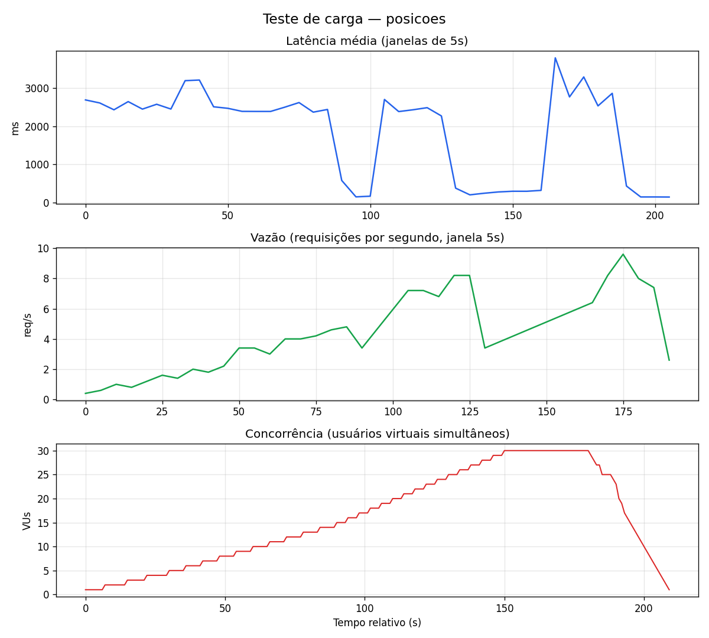
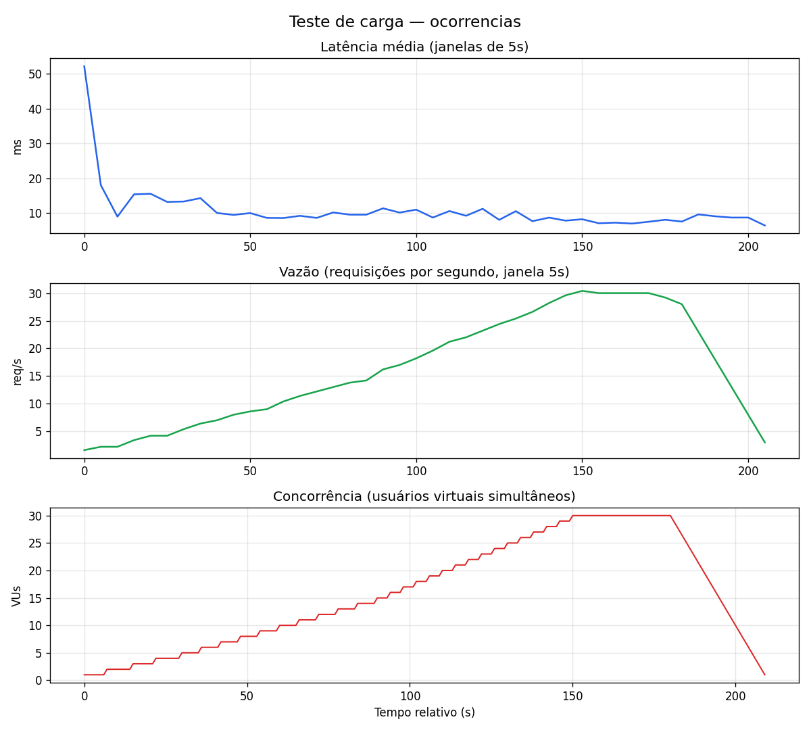

# MEDIÇÕES DO SLA

Relatório de testes de carga com [k6](https://k6.io/). Código dos testes em [`load-testing/scripts/`](../scripts/).

**Página visual (comparação):** abra [`index.html`](index.html) no navegador ou, no GitHub após commit:

`https://github.com/lucas-souuza/unibus/tree/main/load-testing/docs`

> **Status:** medições executadas em 31/05/2026. Gráficos em [`charts/`](charts/) e comparação em [`index.html`](index.html).

**Data da medição:** 31/05/2026

---

## Nome do Serviço 1 — API Posições de ônibus

| Campo | Valor |
|-------|--------|
| **Endpoint** | `GET /api/onibus/posicoes` |
| **Tipo de operações** | Leitura (consulta API externa SPPO + enriquecimento GTFS em memória; sem escrita no banco) |

### Arquivos envolvidos (implementação)

| Arquivo | Papel |
|---------|--------|
| [OnibusPosicaoController.java](https://github.com/lucas-souuza/unibus/blob/main/unibus-app/src/main/java/br/com/unibus/unibus_app/controller/OnibusPosicaoController.java) | Controller REST |
| [OnibusPosicaoService.java](https://github.com/lucas-souuza/unibus/blob/main/unibus-app/src/main/java/br/com/unibus/unibus_app/service/OnibusPosicaoService.java) | Orquestração e agregação por veículo |
| [SppoGpsClient.java](https://github.com/lucas-souuza/unibus/blob/main/unibus-app/src/main/java/br/com/unibus/unibus_app/integration/sppo/SppoGpsClient.java) | Cliente HTTP SPPO |
| [SppoGpsService.java](https://github.com/lucas-souuza/unibus/blob/main/unibus-app/src/main/java/br/com/unibus/unibus_app/integration/sppo/SppoGpsService.java) | Serviço GPS |
| [GtfsRoutesService.java](https://github.com/lucas-souuza/unibus/blob/main/unibus-app/src/main/java/br/com/unibus/unibus_app/integration/gtfs/GtfsRoutesService.java) | Rotas GTFS |
| [SecurityConfig.java](https://github.com/lucas-souuza/unibus/blob/main/unibus-app/src/main/java/br/com/unibus/unibus_app/security/SecurityConfig.java) | Rota pública (`/api/onibus/**`) |

### Arquivos com o código fonte de medição do SLA

| Arquivo | Link |
|---------|------|
| Script k6 | [scripts/posicoes.js](../scripts/posicoes.js) |
| Opções de carga | [scripts/lib/options.js](../scripts/lib/options.js) |
| Geração de gráficos | [tools/generate_report.py](../tools/generate_report.py) |

### Data da medição

31/05/2026

### Descrição das configurações

| Item | Valor |
|------|--------|
| App | Spring Boot 4.0.6, Java 25, porta `8080` |
| Banco | MySQL 8.0 local, `localhost:3306`, DB `unibus` (516 linhas) |
| Cliente de carga | k6 v2.0.0 (Windows) |
| SPPO | `https://dados.mobilidade.rio/gps/sppo` |
| Perfil k6 | Rampa 5 → 30 VUs (~3m30s), `scripts/lib/options.js` |
| Artefato | `results/summary-posicoes-2026-05-31T15-35-08.json` |

### Testes de carga (SLA)

| Métrica | Resultado |
|---------|-----------|
| **Latência** (média) | **889 ms** (p95: **2,89 s**, p99: **4,44 s**) |
| **Vazão** (tentativas) | **11,5 req/s** (2410 requisições em ~3m30s) |
| **Vazão** (somente HTTP 200) | **~3,1 req/s** (655 sucessos) |
| **Concorrência** (VUs máx.) | **30** |
| Taxa de falha HTTP | **72,8%** (502/timeout SPPO sob carga) |

#### Gráficos de evolução

_(Imagem gerada após `run-posicoes.ps1`; se ausente, execute os testes.)_

### LEVANTAMENTO DE HIPÓTESES — gargalos (Serviço 1)

1. **API SPPO externa:** latência e timeout (`read-timeout-ms` até 120s) dominam o tempo de resposta; sob carga, muitas chamadas paralelas podem saturar conexões de saída ou atingir rate limit do provedor.
2. **Processamento em memória:** deduplicação por veículo e parse de coordenadas CPU-bound; com payloads grandes da SPPO, o tempo de serialização JSON aumenta.
3. **Ausência de cache:** cada GET dispara nova consulta à SPPO na janela configurada (`unibus.sppo.janela-segundos`); usuários simultâneos repetem trabalho idêntico.
4. **Thread pool Tomcat:** muitas requisições longas bloqueiam threads, elevando fila e latência percebida.
5. **Rede local:** não é gargalo de disco do MySQL (leitura não persiste), mas rede WAN até `dados.mobilidade.rio`.

---

## Nome do Serviço 2 — API Ocorrências

| Campo | Valor |
|-------|--------|
| **Endpoint** | `POST /api/ocorrencias` |
| **Tipo de operações** | Inserção (escrita na tabela `ocorrencia`; leituras auxiliares de `usuario` e `linha`) |

### Arquivos envolvidos (implementação)

| Arquivo | Papel |
|---------|--------|
| [OcorrenciaController.java](https://github.com/lucas-souuza/unibus/blob/main/unibus-app/src/main/java/br/com/unibus/unibus_app/controller/OcorrenciaController.java) | Controller REST |
| [OcorrenciaService.java](https://github.com/lucas-souuza/unibus/blob/main/unibus-app/src/main/java/br/com/unibus/unibus_app/service/OcorrenciaService.java) | Regra de negócio + transação |
| [OcorrenciaRepository.java](https://github.com/lucas-souuza/unibus/blob/main/unibus-app/src/main/java/br/com/unibus/unibus_app/repository/OcorrenciaRepository.java) | Persistência JPA |
| [Ocorrencia.java](https://github.com/lucas-souuza/unibus/blob/main/unibus-app/src/main/java/br/com/unibus/unibus_app/model/Ocorrencia.java) | Entidade |
| [LinhaRepository.java](https://github.com/lucas-souuza/unibus/blob/main/unibus-app/src/main/java/br/com/unibus/unibus_app/repository/LinhaRepository.java) | Lookup de linha |
| [SecurityConfig.java](https://github.com/lucas-souuza/unibus/blob/main/unibus-app/src/main/java/br/com/unibus/unibus_app/security/SecurityConfig.java) | Autenticação obrigatória |

### Arquivos com o código fonte de medição do SLA

| Arquivo | Link |
|---------|------|
| Script k6 | [scripts/ocorrencias.js](../scripts/ocorrencias.js) |
| Login / CSRF | [scripts/lib/auth.js](../scripts/lib/auth.js) |
| Opções de carga | [scripts/lib/options.js](../scripts/lib/options.js) |
| Geração de gráficos | [tools/generate_report.py](../tools/generate_report.py) |

### Data da medição

31/05/2026

### Descrição das configurações

| Item | Valor |
|------|--------|
| Autenticação | Form login + sessão + CSRF |
| Usuário de teste | `carga@edu.unirio.br` (cadastro via `/cadastro`) |
| Payload | linha `636`, tipo `ATRASO` |
| Artefato | `results/summary-ocorrencias-2026-05-31T15-42-31.json` |

### Testes de carga (SLA)

| Métrica | Resultado |
|---------|-----------|
| **Latência** (média) | **9,1 ms** (p95: **17 ms**, p99: **64 ms**) |
| **Vazão** | **16,2 req/s** (3407 requisições; ~3317 inserções) |
| **Concorrência** (VUs máx.) | **30** |
| Taxa de falha HTTP | **0%** |

#### Gráficos de evolução

### LEVANTAMENTO DE HIPÓTESES — gargalos (Serviço 2)

1. **Pool de conexões JDBC:** inserções concorrentes competem por conexões; fila no HikariCP aumenta latência.
2. **Índices e FKs:** `id_usuario` e `id_linha` exigem validação; falta de índice em `linha.numero_linha` degradaria o `findByNumeroLinha`.
3. **Transações `@Transactional`:** contenção no InnoDB ao inserir muitas linhas na mesma tabela `ocorrencia`.
4. **Sessão + CSRF:** cada VU faz login no `setup`; custo de autenticação pode mascarar ou somar ao tempo do POST.
5. **Crescimento da tabela:** listagens (`GET /api/ocorrencias`) futuras podem degradar se o volume de testes não for limpo.

---

## Comparação entre serviços

| Dimensão | Posições (leitura) | Ocorrências (escrita) |
|----------|-------------------|------------------------|
| Dependência externa | Alta (SPPO) | Baixa |
| Pressão no MySQL | Nenhuma na rota testada | Alta |
| Autenticação | Não | Sim |
| Expectativa de latência | Maior (I/O externo) | Menor por request, limitada pelo DB |

Consulte [`index.html`](index.html) e `report-data.json` para valores numéricos lado a lado após a execução.
