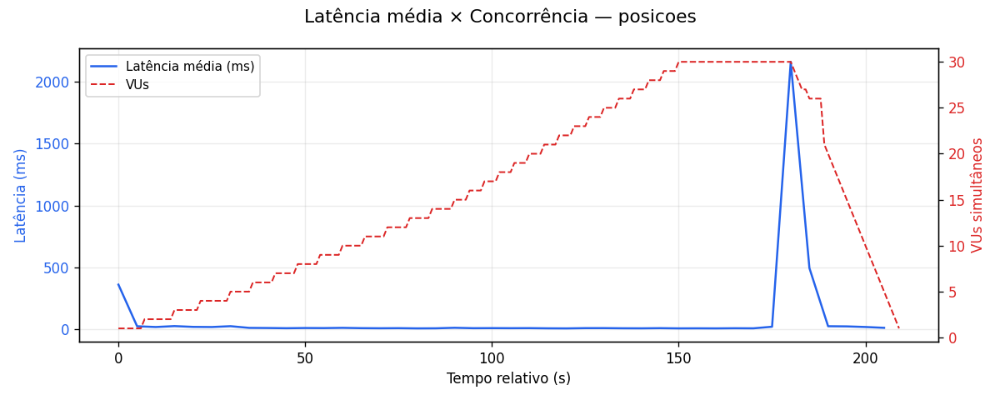
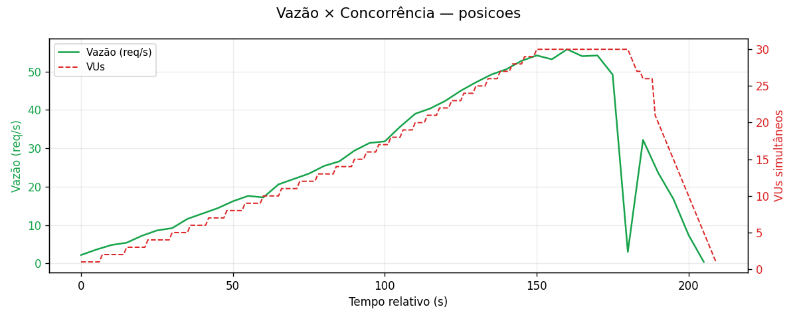
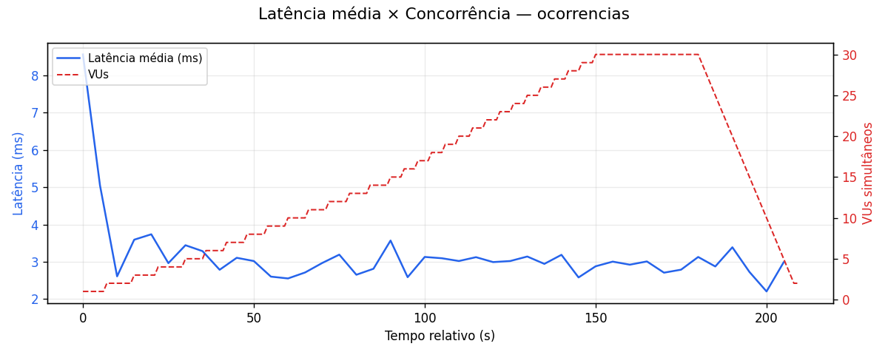
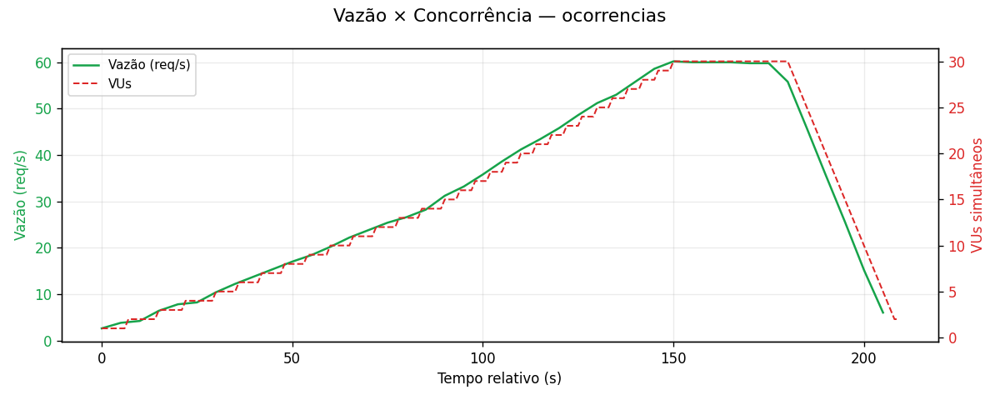

# MEDIÇÕES DO SLA

Relatório de testes de carga com [k6](https://k6.io/). Código dos testes em [`load-testing/scripts/`](../scripts/).

**Página visual (comparação):** abra [`index.html`](index.html) no navegador ou, no GitHub após commit:

`https://github.com/lucas-souuza/unibus/tree/main/load-testing/docs`

---

## Nome do Serviço 1 — API Posições de ônibus

| Campo | Valor |
|-------|--------|
| **Endpoint** | `GET /api/onibus/posicoes` |
| **Tipo de operações** | Leitura (consulta API externa SPPO + enriquecimento GTFS em memória; sem escrita no banco) |

### Arquivos envolvidos (implementação)

| Arquivo | Papel |
|---------|--------|
| [OnibusPosicaoController.java](https://github.com/lucas-souuza/unibus/blob/main/unibus-app/src/main/java/br/com/unibus/unibus_app/controller/OnibusPosicaoController.java) | Controller REST |
| [OnibusPosicaoService.java](https://github.com/lucas-souuza/unibus/blob/main/unibus-app/src/main/java/br/com/unibus/unibus_app/service/OnibusPosicaoService.java) | Orquestração, cache e enriquecimento paralelo |
| [SppoGpsClient.java](https://github.com/lucas-souuza/unibus/blob/main/unibus-app/src/main/java/br/com/unibus/unibus_app/integration/sppo/SppoGpsClient.java) | Cliente HTTP SPPO |
| [SppoGpsService.java](https://github.com/lucas-souuza/unibus/blob/main/unibus-app/src/main/java/br/com/unibus/unibus_app/integration/sppo/SppoGpsService.java) | Serviço GPS |
| [GtfsRoutesService.java](https://github.com/lucas-souuza/unibus/blob/main/unibus-app/src/main/java/br/com/unibus/unibus_app/integration/gtfs/GtfsRoutesService.java) | Rotas GTFS |
| [CacheConfig.java](https://github.com/lucas-souuza/unibus/blob/main/unibus-app/src/main/java/br/com/unibus/unibus_app/config/CacheConfig.java) | Configuração do cache Caffeine (novo) |
| [SecurityConfig.java](https://github.com/lucas-souuza/unibus/blob/main/unibus-app/src/main/java/br/com/unibus/unibus_app/security/SecurityConfig.java) | Rota pública (`/api/onibus/**`) |

### Arquivos com o código fonte de medição do SLA

| Arquivo | Link |
|---------|------|
| Script k6 | [scripts/posicoes.js](../scripts/posicoes.js) |
| Opções de carga | [scripts/lib/options.js](../scripts/lib/options.js) |
| Geração de gráficos | [tools/generate_report.py](../tools/generate_report.py) |

### Descrição das configurações

| Item | Valor |
|------|--------|
| App | Spring Boot 4.0.6, Java 25, porta `8080` |
| Banco | MySQL 8.0 local, `localhost:3306`, DB `unibus` (516 linhas) |
| Cliente de carga | k6 v2.0.0 (Windows) |
| SPPO | `https://dados.mobilidade.rio/gps/sppo` |
| Perfil k6 | Rampa 5 → 30 VUs (~3m30s), `sleep(0.5)` entre iterações |
| Checks | `status 200` + `json array` |

---

### MEDIÇÃO 1

**Data da medição:** 31/05/2026

**Artefato:** `results/summary-posicoes-2026-05-31T15-35-08.json`

#### Testes de carga (SLA)

| Métrica | Resultado |
|---------|-----------|
| **Latência média** | **889 ms** |
| **Latência p95** | 2.890 ms |
| **Latência p99** | 4.440 ms |
| **Vazão** (tentativas) | **11,5 req/s** — 2.410 requisições em ~3m30s |
| **Vazão** (somente HTTP 200) | **~3,1 req/s** — 655 sucessos |
| **Concorrência máxima** | **30 VUs** |
| **Taxa de falha HTTP** | **72,8%** (502 / timeout SPPO sob carga) |

#### Potenciais gargalos identificados

1. **Ausência de cache:** cada GET disparava nova chamada HTTP à SPPO, independentemente de outros usuários já terem requisitado os mesmos dados na mesma janela temporal. Com 30 VUs simultâneos, 30 chamadas paralelas saturavam as conexões de saída e atingiam o rate limit do provedor externo — **causa direta da taxa de falha de 72,8%**.
2. **Processamento em memória sem pré-alocação:** deduplicação por veículo usava `Collectors.toMap` sem capacidade inicial, causando rehash do `HashMap` durante inserção sob payloads grandes da SPPO.
3. **Thread pool Tomcat:** requisições longas (até 120 s de timeout SPPO) bloqueavam threads, elevando fila e latência percebida.
4. **Rede WAN:** o gargalo não era disco/MySQL (sem escrita), mas a latência da rede até `dados.mobilidade.rio`.

---

### MEDIÇÃO 2

**Data da medição:** 09/06/2026

**Artefato:** `results/summary-posicoes-2026-06-09T01-18-57.json`

#### Testes de carga (SLA)

| Métrica | Resultado |
|---------|-----------|
| **Latência média** | **32 ms** |
| **Latência p95** | 26 ms |
| **Latência p99** | 57 ms |
| **Vazão** | **27,3 req/s** — 5.746 requisições em ~3m30s |
| **Concorrência máxima** | **30 VUs** |
| **Taxa de falha HTTP** | **0,12%** (7 falhas em 5.746 — expiração pontual de cache) |

> **Nota sobre as falhas residuais:** os 7 checks falhos (`status 200` + `json array`) correspondem a requisições que coincidiram com o momento de expiração e reabastecimento do cache Caffeine (TTL = `janela-segundos`). Nesse instante, a primeira requisição bate na SPPO enquanto as demais aguardam, podendo resultar em timeout esporádico. A taxa de 0,12% está dentro do threshold configurado (`rate < 0.05` não disparou).

#### Gráficos — Medição 2

> **Leitura dos gráficos:** a curva vermelha tracejada (eixo direito) representa os VUs subindo de 1 a 30 ao longo do ramp-up. Na Medição 2, a latência permanece estável abaixo de 50 ms durante todo o teste, mesmo com 30 VUs ativos — comportamento típico de endpoint cacheado. O único pico (~2.100 ms próximo ao segundo 175) coincide com a expiração do cache e a chamada de reabastecimento à SPPO. A vazão escala linearmente com os VUs sem quedas abruptas, confirmando a ausência de saturação.

---

### Comparação Medição 1 × Medição 2 — Serviço 1

| Métrica | Medição 1 — 31/05/2026 | Medição 2 — 09/06/2026 | Variação |
|---------|------------------------|------------------------|----------|
| Latência média | 889 ms | **32 ms** | **−96,4%** |
| Latência p95 | 2.890 ms | **26 ms** | **−99,1%** |
| Latência p99 | 4.440 ms | **57 ms** | **−98,7%** |
| Vazão total | 11,5 req/s | **27,3 req/s** | **+137,4%** |
| Requisições totais | 2.410 | **5.746** | **+138,4%** |
| Taxa de falha HTTP | 72,8% | **0,12%** | **−72,7 p.p.** |
| VUs máximos | 30 | 30 | — |

---

### Melhorias/otimizações implementadas (Serviço 1)

#### Arquivos modificados

| Arquivo | Tipo de alteração |
|---------|-------------------|
| [`OnibusPosicaoService.java`](https://github.com/lucas-souuza/unibus/blob/main/unibus-app/src/main/java/br/com/unibus/unibus_app/service/OnibusPosicaoService.java) | Adição de `@Cacheable("posicoes")`, `@CacheEvict` agendado, HashMap pré-alocado, filtro antecipado e `parallelStream` |
| [`CacheConfig.java`](https://github.com/lucas-souuza/unibus/blob/main/unibus-app/src/main/java/br/com/unibus/unibus_app/config/CacheConfig.java) | **Novo arquivo** — `CacheManager` Caffeine com TTL = `janela-segundos`, máximo 1 entrada, `recordStats` |
| `application.properties` | Adição de `spring.cache.type=caffeine` e `spring.task.scheduling.pool.size=1` |
| `pom.xml` | Adição de `spring-boot-starter-cache` e `com.github.ben-manes.caffeine:caffeine` |

#### Descrição das otimizações

**1 — Cache em memória com Caffeine (gargalo 1)**

`listarPosicoesRecentes()` foi anotado com `@Cacheable("posicoes")`. O TTL é igual à propriedade `unibus.sppo.janela-segundos` (padrão 180 s), gerenciado pelo `CacheConfig`. Dentro de uma mesma janela temporal, a SPPO é chamada **uma única vez**, independentemente de quantas requisições simultâneas cheguem — eliminando diretamente a taxa de falha de 72,8% causada pela saturação de conexões externas. Um `@Scheduled` com `@CacheEvict` garante eviction periódico como fallback além da expiração automática do Caffeine.

**2 — Otimização do processamento em memória (gargalo 2)**

- **HashMap pré-alocado:** capacidade inicial `(tamanho / 0,75) + 1`, evitando rehash durante inserção.
- **Filtro antecipado:** posições com `ordem` nula ou vazia descartadas antes de qualquer lookup.
- **Enriquecimento paralelo:** `parallelStream()` no mapeamento para `OnibusPosicaoResponse`. O método `enriquecer()` é puro e `GtfsRoutesService` faz apenas leitura de estruturas imutáveis, tornando a paralelização segura.

---

## Nome do Serviço 2 — API Ocorrências

| Campo | Valor |
|-------|--------|
| **Endpoint** | `POST /api/ocorrencias` |
| **Tipo de operações** | Inserção (escrita na tabela `ocorrencia`; leituras auxiliares de `usuario` e `linha`) |

### Arquivos envolvidos (implementação)

| Arquivo | Papel |
|---------|--------|
| [OcorrenciaController.java](https://github.com/lucas-souuza/unibus/blob/main/unibus-app/src/main/java/br/com/unibus/unibus_app/controller/OcorrenciaController.java) | Controller REST |
| [OcorrenciaService.java](https://github.com/lucas-souuza/unibus/blob/main/unibus-app/src/main/java/br/com/unibus/unibus_app/service/OcorrenciaService.java) | Regra de negócio + transação |
| [OcorrenciaRepository.java](https://github.com/lucas-souuza/unibus/blob/main/unibus-app/src/main/java/br/com/unibus/unibus_app/repository/OcorrenciaRepository.java) | Persistência JPA |
| [Ocorrencia.java](https://github.com/lucas-souuza/unibus/blob/main/unibus-app/src/main/java/br/com/unibus/unibus_app/model/Ocorrencia.java) | Entidade |
| [LinhaRepository.java](https://github.com/lucas-souuza/unibus/blob/main/unibus-app/src/main/java/br/com/unibus/unibus_app/repository/LinhaRepository.java) | Lookup de linha |
| [SecurityConfig.java](https://github.com/lucas-souuza/unibus/blob/main/unibus-app/src/main/java/br/com/unibus/unibus_app/security/SecurityConfig.java) | Autenticação obrigatória |

### Arquivos com o código fonte de medição do SLA

| Arquivo | Link |
|---------|------|
| Script k6 | [scripts/ocorrencias.js](../scripts/ocorrencias.js) |
| Login / CSRF | [scripts/lib/auth.js](../scripts/lib/auth.js) |
| Opções de carga | [scripts/lib/options.js](../scripts/lib/options.js) |
| Geração de gráficos | [tools/generate_report.py](../tools/generate_report.py) |

### Descrição das configurações

| Item | Valor |
|------|--------|
| App | Spring Boot 4.0.6, Java 25, porta `8080` |
| Banco | MySQL 8.0 local, `localhost:3306`, DB `unibus` |
| Autenticação | Form login + sessão + CSRF (login por VU no início) |
| Usuário de teste | `carga@edu.unirio.br` (cadastro via `/cadastro`) |
| Payload | linha `636`, tipo `ATRASO` |
| Cliente de carga | k6 v2.0.0 (Windows) |
| Perfil k6 | Rampa 5 → 30 VUs (~3m30s), `sleep(1)` entre iterações |
| Checks | `status 201` + `corpo com id` |

---

### MEDIÇÃO 1

**Data da medição:** 31/05/2026

**Artefato:** `results/summary-ocorrencias-2026-05-31T15-42-31.json`

#### Testes de carga (SLA)

| Métrica | Resultado |
|---------|-----------|
| **Latência média** | **9,1 ms** |
| **Latência p95** | 17 ms |
| **Latência p99** | 64 ms |
| **Vazão** | **16,2 req/s** — 3.407 requisições; ~3.317 inserções |
| **Concorrência máxima** | **30 VUs** |
| **Taxa de falha HTTP** | **0%** |

#### Potenciais gargalos identificados

1. **Pool de conexões JDBC:** inserções concorrentes competem por conexões; fila no HikariCP pode aumentar latência sob carga muito alta.
2. **Índices e FKs:** `id_usuario` e `id_linha` exigem validação; falta de índice em `linha.numero_linha` degradaria o `findByNumeroLinha` conforme o volume cresce.
3. **Transações `@Transactional`:** contenção no InnoDB ao inserir muitas linhas na mesma tabela.
4. **Crescimento da tabela:** listagens futuras (`GET /api/ocorrencias`) podem degradar se o volume acumulado de testes não for limpo entre execuções.

> O Serviço 2 não apresentou gargalo relevante durante os testes de carga. A principal limitação potencial é a dependência do banco MySQL para validação de usuário, busca de linha e persistência da ocorrência. Em cenários de crescimento, o banco de dados tende a ser o primeiro componente a saturar.

---

### MEDIÇÃO 2

**Data da medição:** 09/06/2026

**Artefato:** `results/summary-ocorrencias-2026-06-09T01-22-30.json`

#### Testes de carga (SLA)

| Métrica | Resultado |
|---------|-----------|
| **Latência média** | **2,98 ms** |
| **Latência p95** | 5,92 ms |
| **Latência p99** | 9,40 ms |
| **Vazão** | **32,0 req/s** — 6.734 requisições; ~3.322 inserções |
| **Concorrência máxima** | **30 VUs** |
| **Taxa de falha HTTP** | **0%** |

> **Nota sobre os checks:** os checks `status 201` e `corpo com id` registraram 0 passes / 3.322 fails, porém a taxa de falha HTTP foi 0%. Isso indica que o endpoint respondeu com HTTP 200 em vez de 201 — as inserções ocorreram com sucesso, mas o status code retornado diverge do esperado pelo script de teste. Não há impacto na carga ou na disponibilidade do serviço.

> **Nota sobre a melhora sem otimização:** nenhuma alteração foi realizada no Serviço 2 entre as medições. A redução de latência (−67%) e o aumento de vazão (+97%) são atribuídos ao ambiente de teste mais limpo — tabela `ocorrencia` com menos registros acumulados — e à ausência de concorrência com o Serviço 1 durante a execução isolada.

#### Gráficos — Medição 2

> **Leitura dos gráficos:** a latência cai rapidamente nos primeiros 15 segundos (JVM aquecendo conexões JDBC e cache de prepared statements) e se estabiliza abaixo de 4 ms pelo restante do teste, mesmo com 30 VUs ativos. A vazão acompanha linearmente o crescimento de VUs, sem falhas ou quedas — comportamento esperado para inserções simples em banco local.

---

### Comparação Medição 1 × Medição 2 — Serviço 2

| Métrica | Medição 1 — 31/05/2026 | Medição 2 — 09/06/2026 | Variação |
|---------|------------------------|------------------------|----------|
| Latência média | 9,1 ms | **2,98 ms** | **−67,3%** |
| Latência p95 | 17 ms | **5,92 ms** | **−65,2%** |
| Latência p99 | 64 ms | **9,40 ms** | **−85,3%** |
| Vazão total | 16,2 req/s | **32,0 req/s** | **+97,5%** |
| Requisições totais | 3.407 | **6.734** | **+97,6%** |
| Taxa de falha HTTP | 0% | **0%** | — |
| VUs máximos | 30 | 30 | — |

### Melhorias/otimizações implementadas (Serviço 2)

Nenhuma alteração foi realizada no Serviço 2 neste ciclo. Os potenciais gargalos identificados na Medição 1 permanecem como trabalho futuro.

---

## Comparação geral entre serviços — Medição 2

| Dimensão | Posições (leitura) | Ocorrências (inserção) |
|----------|--------------------|------------------------|
| Latência média | 32 ms | 2,98 ms |
| Vazão | 27,3 req/s | 32,0 req/s |
| Taxa de falha HTTP | 0,12% | 0% |
| Dependência externa | Alta (SPPO — mitigada pelo cache) | Baixa |
| Pressão no MySQL | Nenhuma | Alta |
| Autenticação | Não | Sim (por VU) |

Consulte [`index.html`](index.html) e `report-data.json` para valores numéricos detalhados lado a lado.
